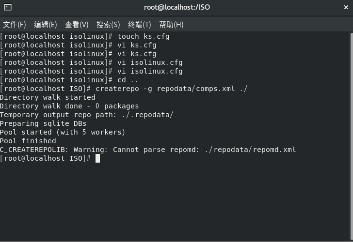

# 实验一

## 一.制作“无人值守”ISO镜像

* 下载所需的ISO


* 安装制作系统镜像所需要的工具


* 创建光盘挂载目录，资源重构目录，自定义数据库目录


* 挂载光盘，同步文件

  同步/mnt/cdrom/下的文件到ISO/路径下，除了Packages和repodata文件夹

```
mkdir /root/test

/usr/bin/rsync -a --exclude=Packages/ --exclude=repodata/ /mnt/cdrom/ /ISO/ 
```

​      在ISO/文件夹下新建Packages和repodata文件夹

```
mkdir -p /ISO/{Packages,repodata} 
```


* 创建自响应文件ks.cfg

  ```
  #version=DEVEL
  install
  # System authorization information
  auth --enableshadow --passalgo=sha512
  # Use CDROM installation media
  cdrom
  # Use graphical install
  #graphical
  text
  # Run the Setup Agent on first boot
  firstboot --disabled
  ignoredisk --only-use=sda
  # Keyboard layouts
  keyboard --vckeymap=us --xlayouts='us'
  # System language
  lang en_US.UTF-8
  # Network information
  network  --bootproto=dhcp --device=ens33 --onboot=yes --ipv6=auto --no-activate
  network  --hostname=begon
  # Root password
  rootpw  12345678
  firewall --disabled
  selinux --disabled
  # System services
  services --disabled="chronyd"
  # System timezone
  timezone Asia/Shanghai --isUtc --nontp
  # System bootloader configuration
  bootloader --append=" crashkernel=auto" --location=mbr --boot-drive=sda
  #autopart --encrypted --type=lvm
  bootloader location=mbr
  clearpart --all --initlabel
  part swap --asprimary --fstype="swap" --size=1024
  part /boot --fstype xfs --size=300
  part / --fstype xfs --size=1 --grow
  #Reboot after installation
  reboot --eject
  %packages
  @^minimal
  @core
  kexec-tools
  %end
  %post
  systemctl stop firewalld
  sed -i 's/^SELINUX=enforcing/SELINUX=disabled/' /etc/selinux/config
  
  
  %end
  %addon com_redhat_kdump --enable --reserve-mb='auto'
  %end
  ```

  


* 修改启动安装导向文件/data/iso/isolinux/isolinux.cfg,下面为修改后内容

  ```
  default vesamenu.c32
  timeout 30
  
  display boot.msg
  
  # Clear the screen when exiting the menu, instead of leaving the menu displayed.
  # For vesamenu, this means the graphical background is still displayed without
  # the menu itself for as long as the screen remains in graphics mode.
  menu clear
  menu background splash.png
  menu title CentOS 7
  menu vshift 8
  menu rows 18
  menu margin 8
  #menu hidden
  menu helpmsgrow 15
  menu tabmsgrow 13
  
  # Border Area
  menu color border * #00000000 #00000000 none
  
  # Selected item
  menu color sel 0 #ffffffff #00000000 none
  
  # Title bar
  menu color title 0 #ff7ba3d0 #00000000 none
  
  # Press [Tab] message
  menu color tabmsg 0 #ff3a6496 #00000000 none
  
  # Unselected menu item
  menu color unsel 0 #84b8ffff #00000000 none
  
  # Selected hotkey
  menu color hotsel 0 #84b8ffff #00000000 none
  
  # Unselected hotkey
  menu color hotkey 0 #ffffffff #00000000 none
  
  # Help text
  menu color help 0 #ffffffff #00000000 none
  
  # A scrollbar of some type? Not sure.
  menu color scrollbar 0 #ffffffff #ff355594 none
  
  # Timeout msg
  menu color timeout 0 #ffffffff #00000000 none
  menu color timeout_msg 0 #ffffffff #00000000 none
  
  # Command prompt text
  menu color cmdmark 0 #84b8ffff #00000000 none
  menu color cmdline 0 #ffffffff #00000000 none
  
  # Do not display the actual menu unless the user presses a key. All that is displayed is a timeout message.
  
  menu tabmsg Press Tab for full configuration options on menu items.
  
  menu separator # insert an empty line
  menu separator # insert an empty line
  
  label linux
    menu label ^Install CentOS 7
    kernel vmlinuz
    append initrd=initrd.img inst.stage2=hd:LABEL=CentOS\x207\x20x86_64 quiet
  
  
  label check
    menu label Test this ^media & install CentOS 7
    menu default
    kernel vmlinuz
    append initrd=initrd.img inst.stage2=hd:LABEL=CentOS\x207\x20x86_64 rd.live.check quiet
  
  label linux
    menu label ^Install CentOS7 CentOS7.4
    menu default
    kernel vmlinuz
    append initrd=initrd.img ks=cdrom:/isolinux/ks.cfg
  
  menu separator # insert an empty line
  
  # utilities submenu
  menu begin ^Troubleshooting
    menu title Troubleshooting
  
  
  label vesa
    menu indent count 5
    menu label Install CentOS 7 in ^basic graphics mode
    text help
          Try this option out if you're having trouble installing
          CentOS 7.
    endtext
    kernel vmlinuz
    append initrd=initrd.img inst.stage2=hd:LABEL=CentOS\x207\x20x86_64 xdriver=vesa nomodeset quiet
  
  label rescue
    menu indent count 5
    menu label ^Rescue a CentOS system
    text help
          If the system will not boot, this lets you access files
          and edit config files to try to get it booting again.
    endtext
    kernel vmlinuz
    append initrd=initrd.img inst.stage2=hd:LABEL=CentOS\x207\x20x86_64 rescue quiet
  
  label memtest
    menu label Run a ^memory test
    text help
          If your system is having issues, a problem with your
          system's memory may be the cause. Use this utility to
          see if the memory is working correctly.
    endtext
    kernel memtest
  
  menu separator # insert an empty line
  
  label local
    menu label Boot from ^local drive
    localboot 0xffff
  
  menu separator # insert an empty line
  menu separator # insert an empty line
  
  label returntomain
    menu label Return to ^main menu
    menu exit
  
  menu end
  ```

  


* 定制ISO光盘所需的数据

​      生成comps.xml文件

```
cp /mnt/cdrom/repodata/*-x86_64.xml /ISO/repodata/comps.xml
```


```
createrepo -g repodata/c6-x86_64-comps.xml ./
```



* 重构系统，生成ISO镜像

```
genisoimage -v -cache-inodes -joliet-long -R -J -T -V CENTOS7 -o /root/centos7.iso -c isolinux/boot.cat  -b isolinux/isolinux.bin -no-emul-boot -boot-load-size 4 -boot-info-table -eltorito-alt-boot -b images/efiboot.img -no-emul-boot .
```

 


## 二.上执行无人安装的ISO镜像

新建虚拟机


镜像安装


